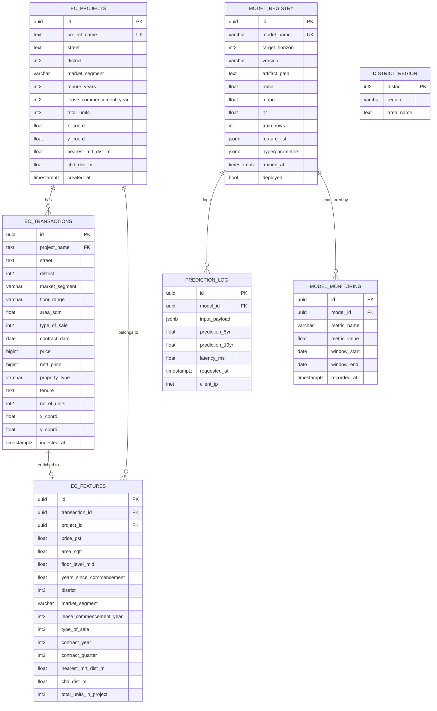
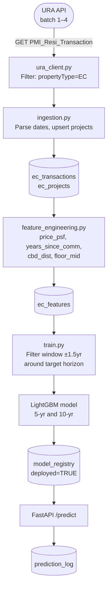
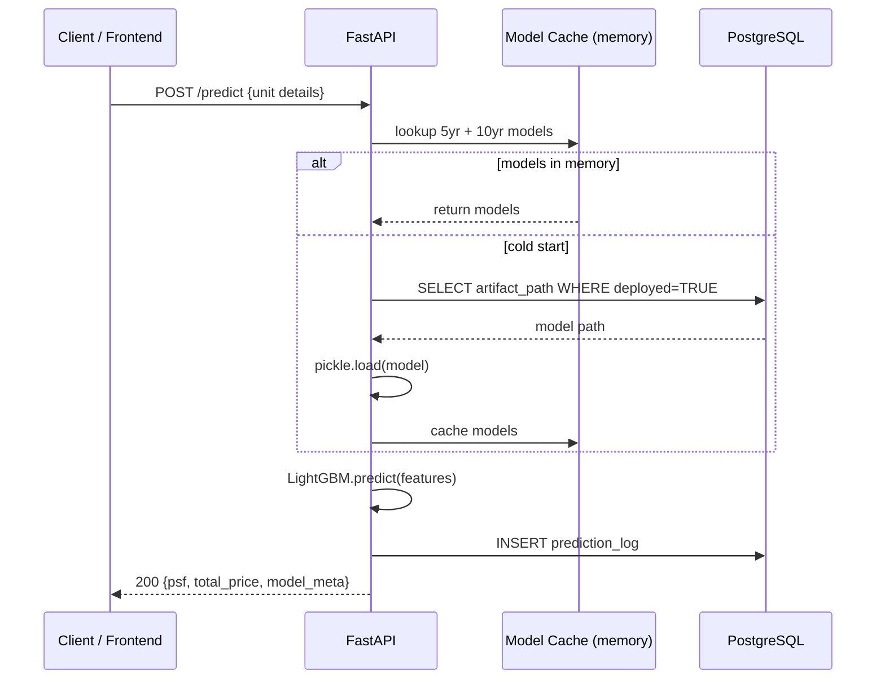
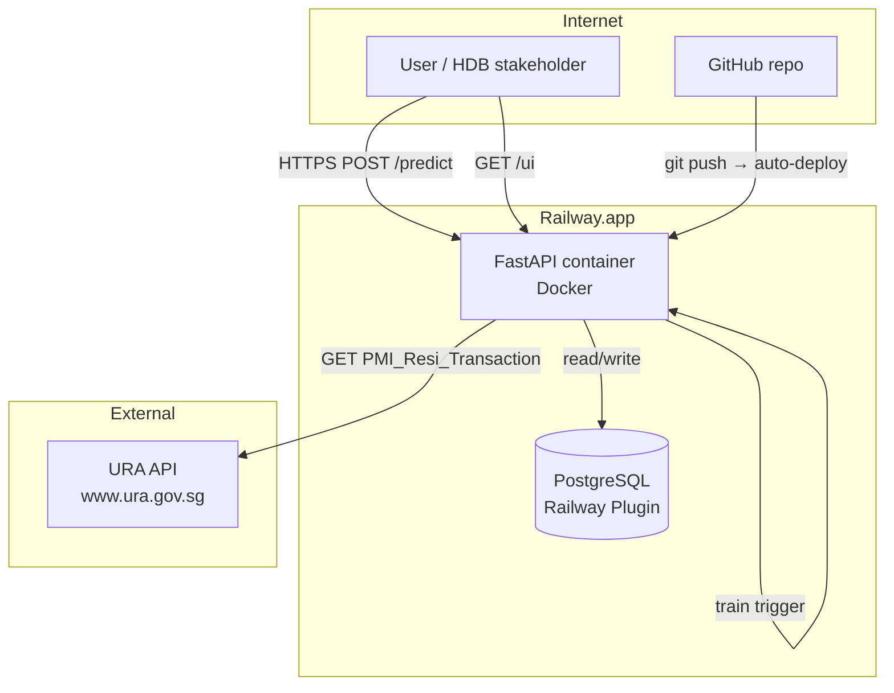
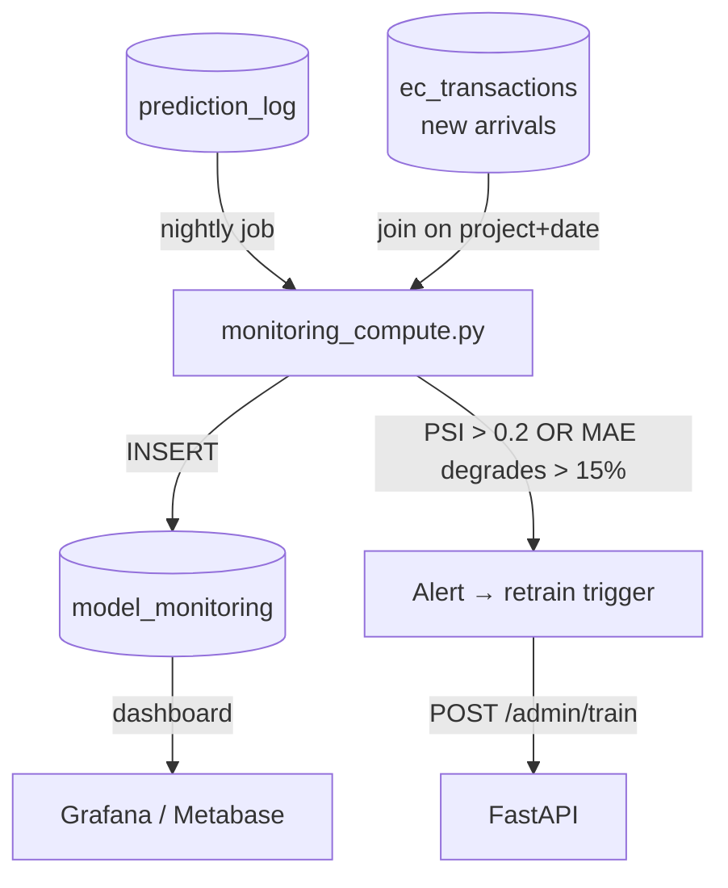
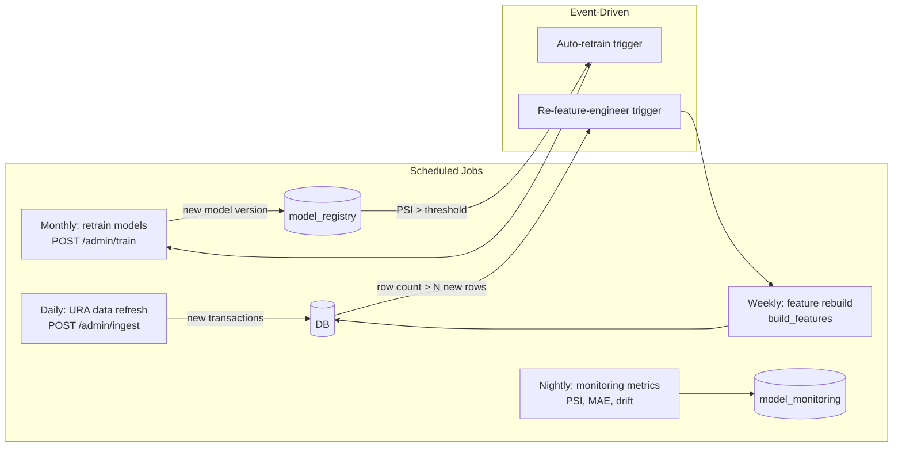

# EC Price Predictor — Solution Documentation

> **Assignment:** Build a scalable, cost-effective ML solution to predict Executive Condominium (EC) resale prices at two milestones — 5-year MOP and 10-year Privatisation.

---

## Table of Contents

1. [Executive Summary](#1-executive-summary)
2. [Data Architecture & Database Model](#2-data-architecture--database-model)
3. [Data Pipeline](#3-data-pipeline)
4. [ML Approach & Model Selection](#4-ml-approach--model-selection)
5. [Feature Engineering](#5-feature-engineering)
6. [API Design](#6-api-design)
7. [Cloud Architecture & Deployment](#7-cloud-architecture--deployment)
8. [Model Monitoring](#8-model-monitoring)
9. [Automation](#9-automation)
10. [Model Governance](#10-model-governance)
11. [Setup & Running Locally](#11-setup--running-locally)

---

## 1. Executive Summary

| Item | Decision |
|---|---|
| **Database** | PostgreSQL 15 in Docker |
| **Data source** | URA Private Residential Property Transactions API |
| **ML framework** | LightGBM (gradient-boosted trees) |
| **API framework** | FastAPI (Python) |
| **Containerisation** | Docker + Docker Compose |
| **Cloud platform** | Railway.app (Postgres plugin + API service) |
| **Frontend** | Vanilla HTML/JS served at `/ui` by the API container |

The system predicts **price per square foot (PSF)** for a given EC unit at the 5-year MOP and 10-year privatisation mark. Two separate LightGBM models are trained — one per time horizon — using historical EC resale transactions filtered to the relevant time window.

---

## 2. Data Architecture & Database Model

### Entity-Relationship Diagram



### Design Decisions

| Decision | Rationale |
|---|---|
| Separate `ec_projects` and `ec_transactions` | Avoids repeating project-level data (location, lease year) on every transaction row |
| `ec_features` as a materialised copy | Decouples raw ingestion from ML consumption; allows feature re-computation without re-fetching API |
| `model_registry` with `deployed` flag | Enables blue/green model switching without downtime |
| `prediction_log` | Complete audit trail; feeds back into monitoring |
| `district_region` seed table | Fast region lookups without external API call |

---

## 3. Data Pipeline



### Key pipeline steps

| Step | File | What it does |
|---|---|---|
| **Ingest** | `src/data/ingestion.py` | Calls URA API batches 1–4, filters ECs, upserts to `ec_transactions` + `ec_projects` |
| **Feature build** | `src/data/feature_engineering.py` | Converts raw rows to ML-ready features, stores in `ec_features` |
| **Train** | `src/model/train.py` | Filters features by time window, trains LightGBM, registers to `model_registry` |
| **Serve** | `api/main.py` | Loads deployed model, runs inference, logs to `prediction_log` |

---

## 4. ML Approach & Model Selection

### Problem Framing

This is a **supervised regression** problem. We predict `price_psf` (SGD per square foot) as a continuous target, then multiply by `area_sqft` for the total price estimate.

Two separate models are trained:
- **Model A** — trained on transactions where `years_since_commencement ∈ [3.5, 6.5]`
- **Model B** — trained on transactions where `years_since_commencement ∈ [8.5, 11.5]`

At inference time, `years_since_commencement` is fixed to 5.0 or 10.0 respectively.

### Model Candidates Considered

| Model | Pros | Cons | Verdict |
|---|---|---|---|
| **Linear Regression** | Interpretable, fast | Cannot capture non-linear interactions (e.g. floor × district premium) | Baseline only |
| **Random Forest** | Robust, handles missing values | Slower inference, tends to underfit on small sets | Considered |
| **XGBoost** | Excellent tabular performance | Slower to train than LightGBM | Close second |
| **LightGBM ✓** | Best speed/accuracy on tabular data, native missing-value handling, SHAP support | Less interpretable than linear | **Selected** |
| **Neural Network (MLP)** | Can learn complex patterns | Needs far more data; EC dataset is small (thousands of rows) | Rejected |

### Why LightGBM wins for this dataset

1. **Small dataset** — Only a few thousand EC transactions exist. Trees generalise better than neural nets at this scale.
2. **Mixed feature types** — District (categorical integer), area (continuous), year (ordinal). LightGBM handles all natively.
3. **Missing values** — MRT distance is missing for older projects. LightGBM handles `NaN` without imputation hacks.
4. **Inference speed** — Sub-millisecond per prediction — critical for a REST API.
5. **Feature importance via SHAP** — Required for regulatory explainability (model governance).

### Hyperparameters

```python
{
    "learning_rate": 0.05,   # Low LR + 1000 trees = conservative, stable training
    "num_leaves": 63,        # 2^6-1: medium complexity for ~thousands of rows
    "feature_fraction": 0.8, # Column subsampling reduces overfitting
    "bagging_fraction": 0.8, # Row subsampling (dropout equivalent)
    "reg_alpha": 0.1,        # L1 — encourages sparse feature selection
    "reg_lambda": 0.1,       # L2 — weight decay equivalent
    "early_stopping": 50,    # Stop if val RMSE doesn't improve for 50 rounds
}
```

### Evaluation Strategy

5-fold cross-validation on the time-windowed subset:

| Metric | Why chosen |
|---|---|
| **RMSE** (SGD/sqft) | Penalises large errors; intuitive unit |
| **MAPE** (%) | Scale-independent; easy to explain to stakeholders ("off by X%") |
| **R²** | Proportion of variance explained; benchmarks vs. a naive mean predictor |

---

## 5. Feature Engineering

```mermaid
flowchart LR
    subgraph Raw
        A[price\nSGD total]
        B[area\nsqm]
        C[floorRange\n"06-10"]
        D[contractDate\n"0124"]
        E[tenure\n"99 yrs from 2018"]
        F[x_coord\ny_coord]
    end
    subgraph Engineered
        G[price_psf\n= price ÷ area_sqft]
        H[area_sqft\n= area × 10.764]
        I[floor_level_mid\n= (6+10)/2 = 8]
        J[years_since_comm\n= Δdays ÷ 365.25]
        K[lease_comm_year\n= 2018]
        L[cbd_dist_m\nEuclidean from SVY21]
    end
    A --> G
    B --> H; B --> G
    C --> I
    D --> J
    E --> K; E --> J
    F --> L
```

| Feature | Type | Engineering |
|---|---|---|
| `price_psf` | Target | `(price / no_units) / area_sqft` |
| `area_sqft` | Continuous | `area_sqm × 10.7639` |
| `floor_level_mid` | Continuous | Midpoint of floor range string |
| `years_since_commencement` | Continuous | `(contract_date − Jan 1, comm_year) / 365.25` |
| `lease_commencement_year` | Ordinal | Extracted from tenure string |
| `district` | Categorical int | Passed directly |
| `market_segment_enc` | Encoded | LabelEncoder on CCR/RCR/OCR |
| `contract_year` / `contract_quarter` | Ordinal | Captures macro market cycles |
| `cbd_dist_m` | Continuous | Euclidean distance in SVY21 coordinates |
| `nearest_mrt_dist_m` | Continuous | Stored per-project, imputed with median if missing |
| `total_units_in_project` | Continuous | Proxy for project scale / amenity quality |

---

## 6. API Design

### Endpoints

```
GET  /           → Welcome + link to /docs
GET  /health     → DB connectivity check
POST /predict    → Predict MOP + privatisation price  ← main endpoint
GET  /predict/model/info  → Deployed model metadata
POST /admin/ingest        → Trigger URA data pull (requires X-Admin-Token)
POST /admin/train         → Trigger model training (requires X-Admin-Token)
GET  /admin/monitoring    → Recent monitoring metrics
GET  /ui                  → Frontend HTML interface
```

### Predict request/response

```json
// POST /predict
{
  "area_sqft": 1076,
  "floor_level": 8,
  "district": 19,
  "market_segment": "OCR",
  "lease_commencement_year": 2019,
  "nearest_mrt_dist_m": 450,
  "cbd_dist_m": 16000,
  "total_units": 820
}

// 200 OK
{
  "input": { ... },
  "mop_5yr": {
    "psf": 1142.50,
    "total_price_est": 1229330,
    "model_version": "20240501_103000",
    "model_rmse": 68.4,
    "model_mape": 5.8,
    "model_r2": 0.871
  },
  "privatisation_10yr": {
    "psf": 1310.20,
    "total_price_est": 1409775,
    ...
  },
  "note": "Predictions are indicative estimates based on historical EC transactions."
}
```

### API Flow



---

## 7. Cloud Architecture & Deployment

### Deployment on Railway.app

Railway was chosen because:
- **Zero config** — connects to GitHub, auto-deploys on push
- **Built-in PostgreSQL** — no separate RDS/Cloud SQL setup
- **Server-side IP** — URA API WAF allows server IPs (blocks desktop IPs)
- **Free tier** — $5/month credit covers this workload
- **Custom domain + HTTPS** — included



### Deployment steps

```bash
# 1. Push to GitHub
git init && git add . && git commit -m "Initial commit"
gh repo create ec-price-predictor --public --source=. --push

# 2. On railway.app:
#    New Project → Deploy from GitHub → select repo
#    Add PostgreSQL plugin
#    Set env vars:
#      URA_ACCESS_KEY = 08d78db0-5e22-4bbc-b1a6-52938481d883
#      POSTGRES_PASSWORD = <auto-set by Railway plugin>
#      DATABASE_URL     = <auto-set by Railway plugin>
#      ADMIN_TOKEN      = <your-secret>

# 3. On first boot, the API auto-runs:
#    ingest() → build_features() → train(5) → train(10)
#    Then the /predict endpoint is live.
```

---

## 8. Model Monitoring

### Proposed Metrics

| Metric | What it detects | How computed |
|---|---|---|
| **PSI** (Population Stability Index) | Input feature drift (e.g. district distribution shifts) | Compare current week's input dist vs. training dist |
| **Prediction drift** | Output distribution shift (model becoming stale) | Rolling 30-day mean/std of predicted PSF vs. training baseline |
| **MAE on actuals** | Ground-truth error when new transactions arrive | Join prediction_log with ec_transactions on (project, date range) |
| **MAPE on actuals** | Same, scale-independent | Same join |
| **Latency p95** | Regression in serving performance | From prediction_log.latency_ms |
| **Request volume** | Unusual usage spikes | COUNT(*) from prediction_log |

### Monitoring Flow



### PSI Thresholds (standard industry practice)

| PSI | Interpretation | Action |
|---|---|---|
| < 0.1 | Stable | No action |
| 0.1 – 0.2 | Minor shift | Investigate |
| > 0.2 | Significant drift | Retrain immediately |

### Incorporating into the Solution

The `model_monitoring` table already exists in the schema. A nightly cron job (e.g. Railway cron service or a simple `schedule` library) would:
1. Pull last 30 days of predictions from `prediction_log`
2. Compute PSI per feature vs. training distribution
3. Compute MAE/MAPE where actuals are available
4. Write to `model_monitoring`
5. If PSI > 0.2 or MAE degrades > 15% vs. baseline → trigger `POST /admin/train`

---

## 9. Automation



### Automation Proposal

| What | Trigger | Implementation |
|---|---|---|
| **Data ingestion** | Daily cron (midnight SGT) | Railway cron service → `POST /admin/ingest` |
| **Feature rebuild** | After each ingest | Chained in `ingestion.py` via `build_features()` |
| **Model retraining** | Monthly OR when PSI > 0.2 | Railway cron + monitoring alert webhook |
| **Model deployment** | After training completes | `model_registry.deployed = TRUE` auto-activates via `invalidate_cache()` |
| **Monitoring compute** | Nightly | Separate lightweight cron job |

### For a production MLOps stack, consider:

- **Airflow / Prefect** for pipeline orchestration (DAG: ingest → features → train → validate → deploy)
- **MLflow** for experiment tracking (replaces the `model_registry` table)
- **Great Expectations** for data quality checks between ingest and feature build

---

## 10. Model Governance

### Access Controls

| Role | Permissions |
|---|---|
| **Public** | `POST /predict`, `GET /health`, `GET /ui` |
| **Admin** (X-Admin-Token header) | All above + ingest, train, monitoring endpoints |
| **DB admin** | Direct PostgreSQL access (Railway dashboard, VPN-gated) |

In production, replace the simple bearer token with **OAuth2 + role-based scopes** (e.g. Auth0 or AWS Cognito).

### Model Versioning

Every trained model gets a timestamp-based version (e.g. `20240501_103000`) stored in `model_registry`. Only one version per horizon has `deployed = TRUE`. Rolling back is a single SQL update:

```sql
UPDATE model_registry SET deployed = FALSE WHERE model_name = 'current_bad_model';
UPDATE model_registry SET deployed = TRUE  WHERE model_name = 'previous_good_model';
```

The API's in-memory cache is invalidated automatically on the next prediction.

### Bias Testing

ECs are concentrated in OCR districts. Potential biases to test:

| Bias type | How to detect | Mitigation |
|---|---|---|
| **Geographic bias** | Compute MAPE per district; check if OCR districts dominate training data | Stratified sampling or district-level post-hoc adjustment |
| **Time bias** | Check if model trained on 2018-2022 data generalises to 2023-2025 | Walk-forward validation (train on earlier data, test on later) |
| **Size bias** | Check residuals by unit size bucket (small/medium/large) | Ensure all size bins are represented in training data |
| **New-development bias** | New ECs may have no comparable transactions | Flag predictions for projects with < 10 matching comparables |

### Audit Trail

- Every prediction stored in `prediction_log` with timestamp, input payload, and client IP
- Model metadata (training date, data range, metrics) in `model_registry`
- All admin actions (ingest, train triggers) logged in application logs

### Regulatory Considerations

Given HDB's regulatory role:
1. **Explainability**: SHAP feature importance plots should accompany each model release
2. **Data provenance**: `ingested_at` timestamp on every transaction row
3. **Right to explanation**: The API returns model RMSE/MAPE so consumers understand prediction uncertainty
4. **Periodic review**: Recommend quarterly model review with HDB data team sign-off before deployment

---

## 11. Setup & Running Locally

### Prerequisites
- Docker Desktop
- Git

### Steps

```bash
# 1. Clone
git clone https://github.com/YOUR_USERNAME/ec-price-predictor
cd ec-price-predictor

# 2. Configure
cp .env.example .env
# Edit .env — URA_ACCESS_KEY is already set

# 3. Start services
docker compose up -d --build

# 4. Watch logs (ingestion + training happen automatically)
docker compose logs -f api

# 5. Test prediction
curl -X POST http://localhost:8000/predict \
  -H "Content-Type: application/json" \
  -d '{"area_sqft":1076,"floor_level":8,"district":19,"market_segment":"OCR","lease_commencement_year":2019}'

# 6. Open the UI
open http://localhost:8000/ui
```

### API Documentation (auto-generated)

```
http://localhost:8000/docs      ← Swagger UI
http://localhost:8000/redoc     ← ReDoc
```

### Trigger manual operations

```bash
# Re-ingest (after token is refreshed)
make ingest

# Retrain models
make train

# Run prediction via make
make predict
```
